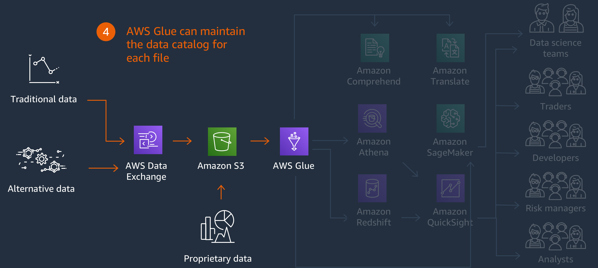
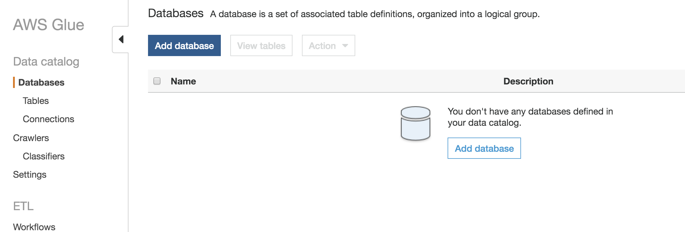
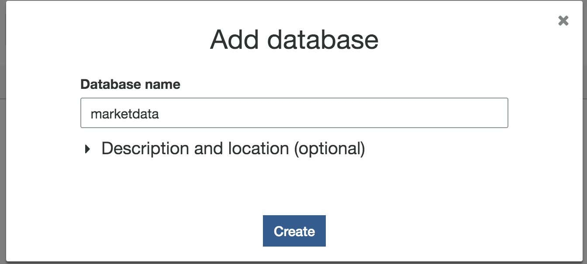
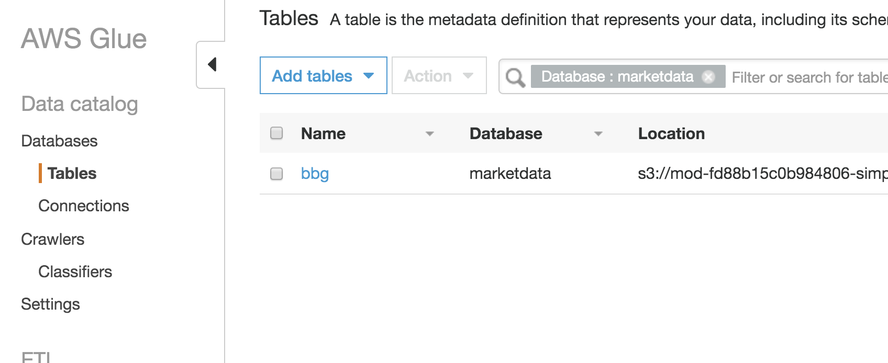
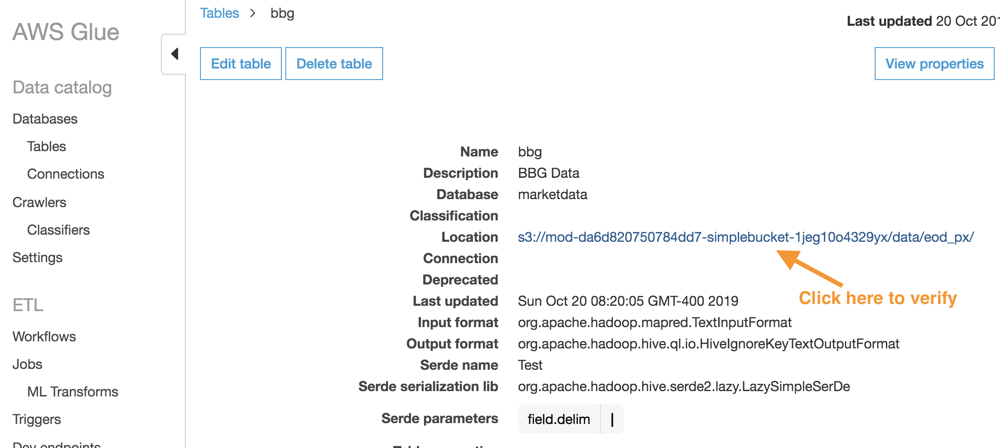
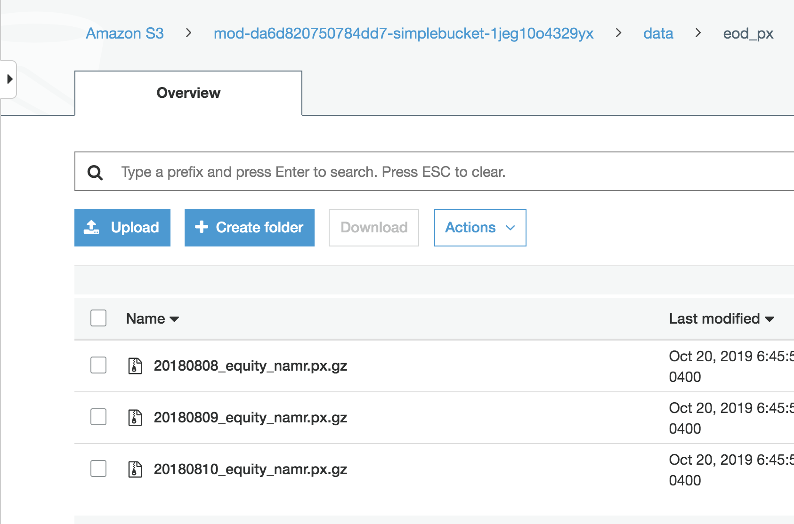

# Create the data catalog in AWS Glue

## What are we building?


## Why are we building it?
Once the data has been catalogued, it becomes discoverable by other services.

**Time to complete:** 15-20 minutes.

### Step 1: Create Database in AWS Glue

1. Navigate to AWS Glue [in the console](https://console.aws.amazon.com/glue)
1. In AWS Glue, on the side bar, click on **Databases**
1. Click on **Add database**

1. Provide a name: **marketdata**

1. Click on **Create**

### Step 2: Generate AWS Glue data catalog
In this step, we will use the catalog script that was provided along with the data.

1. Navigate back to your AWS Cloud9 environment [in the console](https://console.aws.amazon.com/cloud9)

1. In AWS Cloud9, go to **scripts** directory and edit **glueworkshop.py**
  ```
  TeamRole:~/environment $ cd scripts
  TeamRole:~/environment/scripts $ vi glueworkshop.py
  ```
  

1. Change **location** to _s3://&lt;bucketname&gt;/data/eod_px_ and save the file
(Note: you can get your bucket name by running ```$ aws s3 ls | grep simplebucket```)

1. Ensure that you're using **Python 3** in AWS Cloud9

  <details>
  <summary><strong>Expand if you want detailed directions</strong></summary><p>

  Check the python settings in AWS Cloud9 by following these steps:

  1. Navigate to AWS Cloud9 [in the console](https://console.aws.amazon.com/cloud9)
  1. Click on the **settings** icon on the top right corner
  1. Click on folder **Python Support** and check on the right that **Python Version** is **Python 3**

  </p></details>

1. Install **boto3** library for python
    ```
    TeamRole:~/environment/scripts $ python -m pip install --user boto3
    …
    Successfully installed boto3-…
    ```

1. Run the AWS Glue catalog script. The return value will be **None** and is normal
  ```
  TeamRole:~/environment/scripts $ python3 glueworkshop.py
  ```

### Step 3: Verify creation of data catalog

1. In AWS Glue, go to **Tables**, you should notice the table **bbg**  


1. Click on **bbg**, you should notice the catalog (S3 location + schema).


### Step 4: Cross check against S3 location

1. Click on the highlighted S3 **Location** to make sure it is pointing to the right S3 folder where the data (.gz files) resides, as below.


## Next step:

We're ready to run SQL queries against raw files using [Amazon Athena](../2_AmazonAthena).
