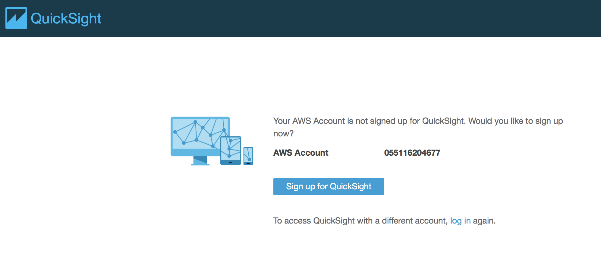
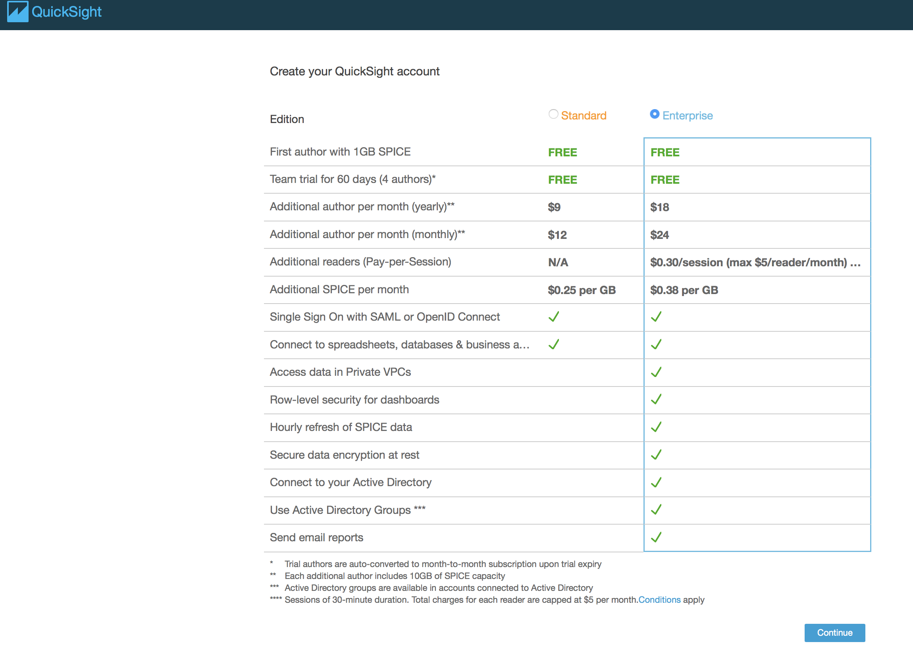
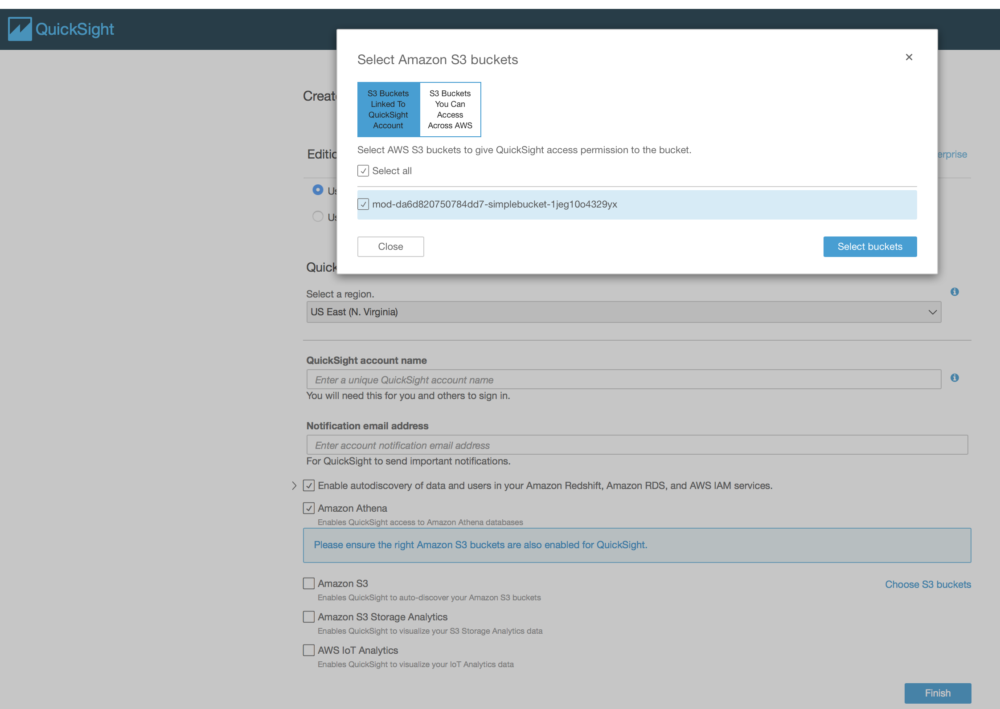
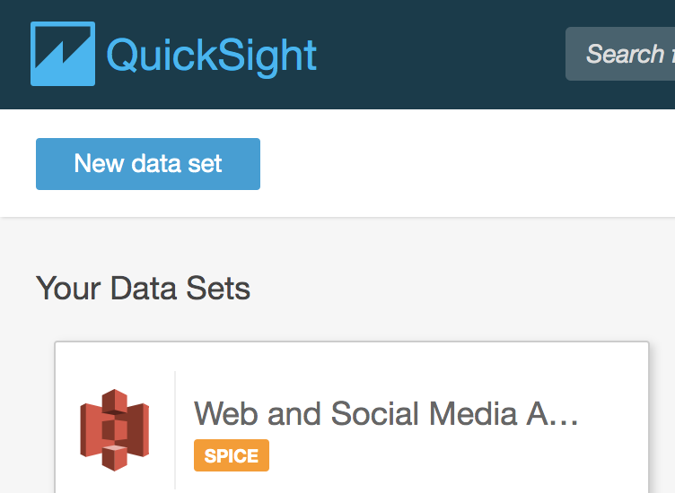
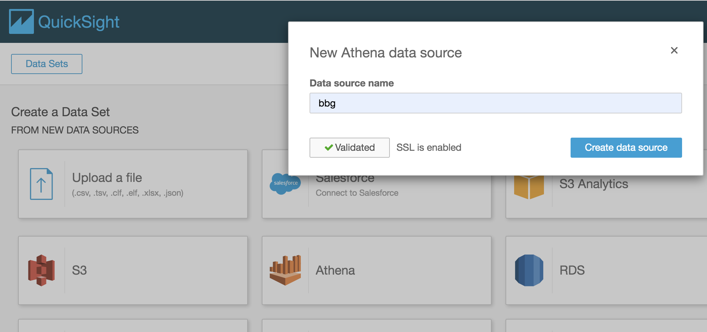
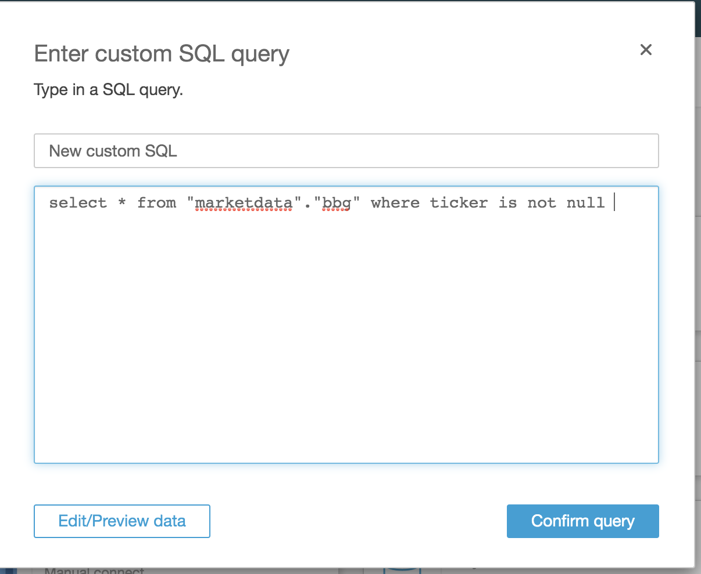
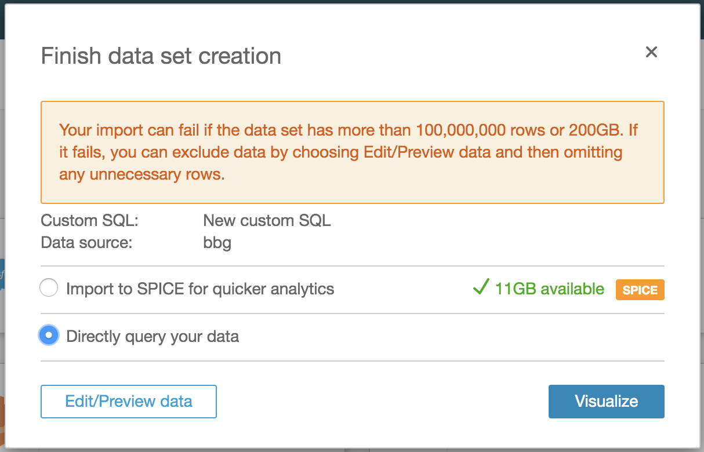
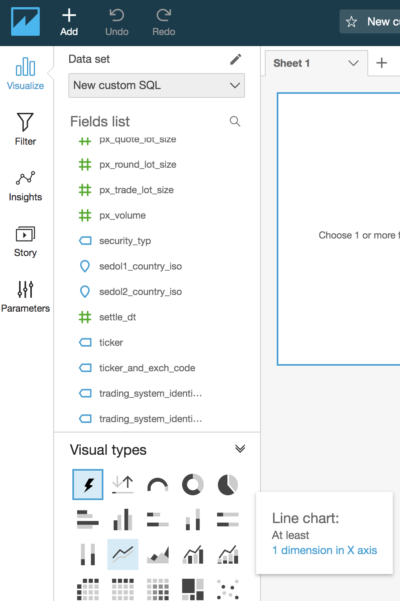
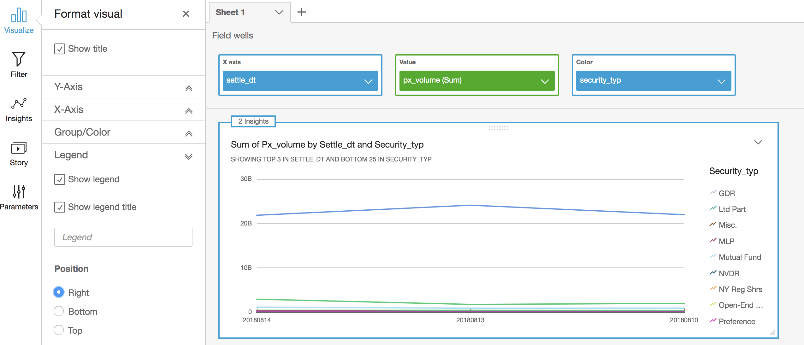
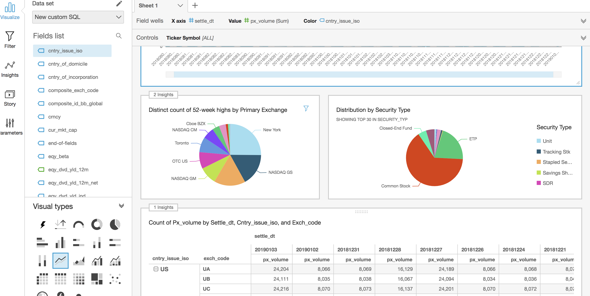

# Visualize data using Amazon QuickSight

**Time to complete:** 15-30 minutes.

### Step 1: Signup for Amazon QuickSight settings

1. Navigate to Amazon QuickSight [in the console](https://quicksight.aws.amazon.com/)

1. Signup for QuickSight

  

1. Select “Enterprise” edition

  

1. Provide Amazon QuickSight account name and a notification email address

1. Choose S3 location, and pick the **&lt;mod-...-simplebucket-...&gt;** bucket

  

Note*: You can ignore the IAM warnings from QuickSight

### Step 2: Amazon QuickSight dataset configuration

1. Navigate back to the QuickSight landing page [in the console](https://quicksight.aws.amazon.com/)

1. Click on **Manage data** button on the top right corner

  

1. Click on **New data set**

  

1. Click **Athena** and in **Data source name** type “bbg”

  

1. Click on **Validate connection** to verify

1. Click on **Create data source** , choose **marketdata** database and **bbg** table

1. Select **Custom SQL** and use the following query
  ```
  select * from "marketdata"."bbg" where ticker is not null
  ```

    

1. Click on **Confirm Query**

1. Select **Directly query your data** option and Click on **Visualize**

  

### Step 3: Visualize raw data in Amazon QuickSight

1. Continue on the Visualization from previous step
Note: If navigated out, go back to QuickSight dashboard and choose "New custom SQL analysis" that was created recently.

1. Select **Line Chart** from the **Visual types** in the bottom left corner

  

1. Choose _settle_dt_ for **X axis**, _px_volume_ for **value**, and choose _security_typ_ for **color**

  
Note: Click on down arrow next to *settle_dt* in the chart and change format without the commas

1. Similarly try **Bar Charts**, **Pivot Tables** to visualize the data.

  

## Next step:

We're ready to do complex analytics and periodic reporting using [Amazon Redshift](../4_AmazonRedshift).
